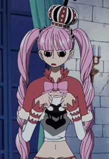

<h1><p align="center">Perona 👻</p></h1>
<div align="center"></img></div>

`Perona` foi criada com o intuito que qualquer pessoa consiga criar seus próprios script para Mu Online, sem a necessidade de saber sobre `Engenharia Reversa.` <br>
O projeto inteiro foi tipado para que possa facilitar a vida de quem for desenvolver os scripts.<br>
Atualmente a `Perona` está na sua versão `Alpha (1.0.0)`<br>

# ATENÇÃO
Por ser um projeto gratuito `>EU<` não garanto que eu irei continuar mantendo atualizado ou adicionando novas features no futuro.<br>
O projeto em sí foi criado apenas para estudar a integração entre `Rust e Lua`<br>
* Perona só tem suporte para versão `21.2.3.0 (Season 21 - Parte 2-3)`

# Estrutura
```
perona/
├── plugins/ - Pasta relacionado aos plugins premium. 
├── script/
│   ├── Define/ - Nessa pasta ficam todas as definições, como constantes e enums.
│   │   ├── Constants.lua
│   │   ├── Enum.lua
│   │   └── Load.lua
│   ├── Types/ - Tipagem do projeto.
│   │   ├── Client.lua
│   │   ├── Project.lua
│   │   ├── Player.lua
│   ├── Scripts/ - Scripts de exemplo.
│   │   ├── AutoPotion.lua
│   │   ├── Camera.lua
│   │   └── Load.lua
│   ├── Utils/
│   │   ├── Helpers.lua
│   │   ├── Json.lua
│   │   ├── VirtualKey.lua
│   │   └── Load.lua
│   └── ScriptMain.lua - Importe todos os seus scripts no ScriptMain.lua.
└── perona.exe
```
* Aconselho seguir a mesma estrutura do projeto. Se dentro da sua pasta tiver varios arquivos `.lua` e aconselhado adicionar tudo em um `Load.lua` e importar no `ScriptMain.lua`. Para não quebrar o padrão do projeto é bom criar as pastas dos seus scripts dentro da pasta `Scripts`

# Por onde começar?
1) Você precisa baixar o [Visual Studio (vscode)](https://code.visualstudio.com/thank-you?dv=win64user) (Não é necessário ser o `VSCODE`)
2) Baixar o plugin [Lua](https://marketplace.visualstudio.com/items?itemName=sumneko.lua) no `vscode`
3) Baixar o código de exemplo em [https://perona.fun/download](https://perona.fun/download)
* Se você é somente um jogador e não um programador. Toda estrutura do projeto está anotada na pasta `Structs` e você pode abrir em alguma `Inteligencia Artificial` e pedir para a `IA` construir para você.

Qualquer dúvida ou problema entre em nosso [discord](https://perona.fun/discord)

# AVISOS
1) Tente seguir sempre o padrão da arquitetura. Você pode criar uma pasta dentro de `Scripts` e criar seus scripts dentro dessa pasta que você criou. 
2) Não importe os modulos padrão que estão importado em `ScriptMain.lua`. Os modulos padrão são de escopo global então não é necessário re-importar.
3) Não importe nada da pasta `Types`. A pasta `Types` é a tipagem para o `LuaLS` adicionar autocomplete.
4) Apenas importe os arquivos que você mesmo criou.
5) Todas as funções e bridges você pode encontrar em `script/Types`

# Tutorial
### Arquitetura
```
perona/
├── perona.exe
└── Scripts/
    ├── Load.lua - Carregar os scripts das pastas ou .lua
    └── Example/
        ├── Load.lua - Carregar os arquivos .lua que estão dentro da pasta Example
        └── Example.lua
```

```lua
-- Scripts/Load.lua
require("Scripts\\Example\\Load")
```

```lua
-- Scripts/Example/Load.lua
require("Scripts\\Example\\Example")
```


```lua
-- Scripts/Example/Example.lua
local auto_potion = {}

function auto_potion.init()
    if Map.getMapId() == Enums.MapIndex.LORENCIA then
        
        if not Map.isSafeZone() then
            Player.use_potion("q")
        end
    end
end

-- Você precisa sempre chamar o BridgeFunctionAttach e ele que vai fazer o script sempre rodar em segundo plano sem parar.
BridgeFunctionAttach('MainProcThread', auto_potion.init) 
```
